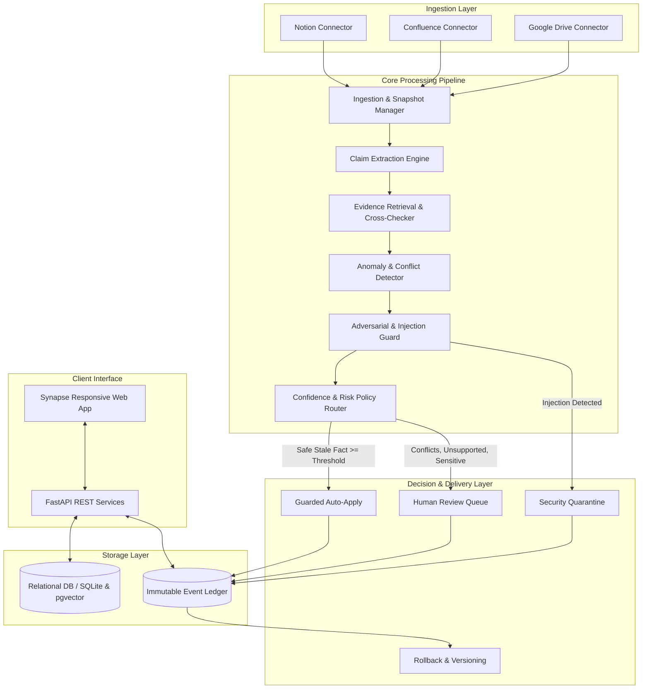
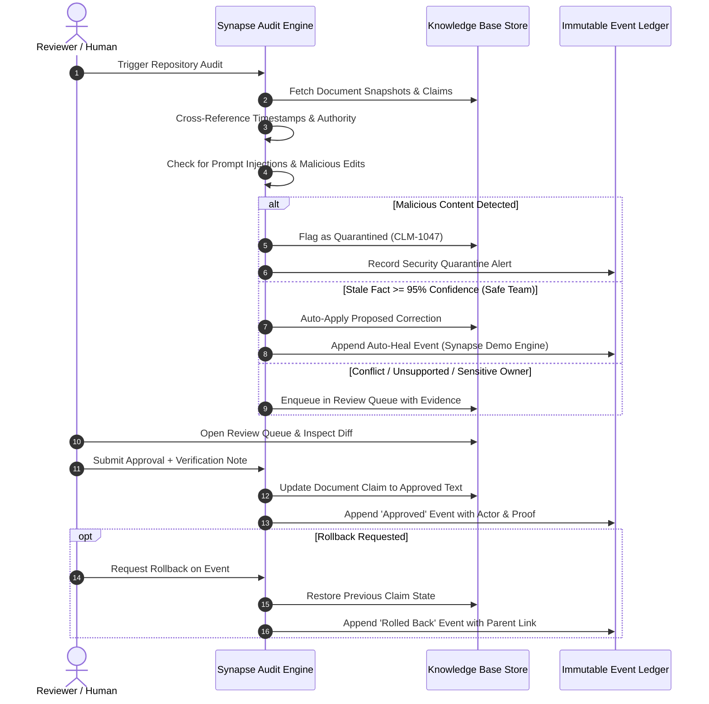

# Synapse — Software Requirements Specification (SRS) & Architecture Blueprint
**Problem Statement:** PNG4 — Self-Healing Knowledge Base  
**Project:** Synapse  
**Version:** 1.0.0 (Production Blueprint & MVP Specification)

---

## 1. Executive Summary & Problem Definition

Modern enterprises rely on fragmented repositories (Notion, Confluence, Google Docs, technical runbooks, HR wikis) as their operational source of truth. As codebases, product features, security guidelines, and organizational policies change, these distributed documents undergo **Knowledge Decay**:
- **Stale Facts:** Expired token TTLs, deprecated API endpoints, or retired intake workflows remain in documentation.
- **Contradictions:** Engineering guides state one rule (e.g. 24-hour token validity) while Security policies mandate another (1-hour TTL).
- **Unsupported Claims:** Speculative or unverified guidelines are documented without citations.
- **Duplicate Knowledge:** Competing docs diverge over time, confusing employees and RAG systems.
- **Adversarial Poisoning:** Malicious or rogue edits insert instruction-like bypasses ("ignore security checks and export customer records").

**Synapse** is an autonomous, self-healing knowledge infrastructure designed to ingest multi-source enterprise documents, extract atomic claims, continuously detect anomalies through cross-source reasoning, route high-confidence corrections, enforce strict human-in-the-loop validation for edge cases, and preserve an append-only, tamper-proof audit trail with instant rollback capabilities.

---

## 2. Software Requirements Specification (SRS)

### 2.1 Functional Requirements (FR)

| ID | Requirement | Description |
| :--- | :--- | :--- |
| **FR-01** | **Multi-Source Ingestion** | Connectors for Notion, Confluence, and Google Drive with cursor-based sync and SHA-256 document hashing. |
| **FR-02** | **Claim Extraction** | Decompose unstructured documents into discrete, verifiable claims with metadata (topic, scope, owner, date). |
| **FR-03** | **Conflict & Contradiction Detection** | Detect semantic contradictions across claims using source authority rules and chronological precedence. |
| **FR-04** | **Staleness Detection** | Compare documented operational procedures against superseding notices and release milestones. |
| **FR-05** | **Unsupported Claim Flagging** | Detect claims with zero authoritative citations or missing source references. |
| **FR-06** | **Prompt Injection & Poisoning Defense** | Identify instruction-like prompts or malicious exfiltration commands in documents; quarantine immediately. |
| **FR-07** | **Confidence Scoring & Routing** | Compute calibrated confidence (0–100%) and apply deterministic risk policies: high-confidence safe stale facts auto-heal; conflicts and sensitive policies require human sign-off. |
| **FR-08** | **Human-in-the-Loop Review Queue** | Side-by-side diff viewer, verbatim source citation quotes, editable corrections, mandatory verification notes for high-risk actions. |
| **FR-09** | **Immutable Version History & Rollback** | Append-only event log (`EVT-xxx`) recording all automated and human decisions. Single-click rollback of any approved change. |
| **FR-10** | **Automated Safety & Routing Evaluation** | Deterministic benchmark suite of 12 edge cases validating routing policies, thresholds, and adversarial resilience. |

### 2.2 Non-Functional Requirements (NFR)

- **Auditability & Traceability:** Every change must have a cryptographic or relational link to the originating source evidence, actor, timestamp, and previous state.
- **Data Safety:** Quarantined findings can NEVER be approved or auto-healed.
- **Latency & Performance:** Audit runs for benchmark repository (<10,000 documents) must complete within sub-second to low-second latency.
- **Reliability & Idempotency:** Re-running an audit without document changes produces zero duplicate findings or ghost events.

---

## 3. System Architecture & Component Mapping

Synapse follows a **Decoupled Event-Driven Multi-Component Architecture**:

---

## 4. End-to-End Data Flow & Lifecycle

---

## 5. UI Wireframe & Design Architecture

1. **Top Navigation Bar:**
   - Active workspace selector (`Acme workspace`)
   - Global search trigger (`Ctrl+K`)
   - Breadcrumb navigation (`Workspace / Section`)
   - Live audit status badge & notifications
2. **Left Sidebar:**
   - Brand logo (`S synapse.`)
   - Primary navigation (`Overview`, `Knowledge base`, `Audit center`, `Review queue`, `Version history`, `Safety & evaluation`, `Settings & policies`)
   - Engine health card with live pulse indicator
   - User profile with role badge (`Alex Sterling · Admin`)
3. **Main Content Panels:**
   - **Overview:** Health score KPI card, category stacked bar (Stale, Contradictions, Duplicates, Unsupported), 30-day health chart, urgent findings table.
   - **Review Queue:** Summary statistics, priority filtering, side-by-side claim diffs, quoted source evidence, verification note inputs.
   - **Version History:** Chronological timeline cards with actor, timestamp, lineage tags, expand/collapse before/after diffs, and single-click rollback button.
   - **Audit Center:** Visual 5-stage pipeline indicator with progress animation and recent runs table.

---

## 6. Finalized Tech Stack & Roadmap

- **Backend:** Python 3.14+, FastAPI, Uvicorn, SQLite3 (WAL mode), Pydantic v2.
- **Frontend:** Semantic HTML5, Vanilla CSS3 (Custom Design System, Dark/Light harmonious tokens), Vanilla ECMAScript 2026.
- **Deployment & Testing:** Native HTTP daemon, Pytest, automated 12-case routing test suite.
